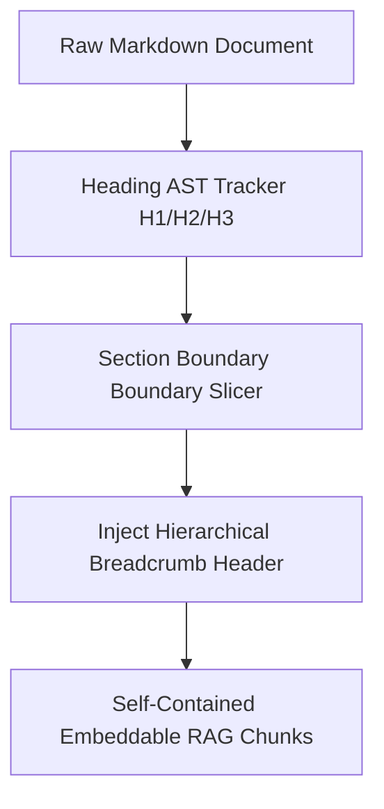

# GenPark AI Agent Skill - Hierarchical Markdown Chunker & Heading Anchor

Deconstructs Markdown documents into semantically anchored RAG chunks that retain ancestor heading breadcrumbs to prevent loss of context.

Verified by [GenPark AI](https://genpark.ai) and compatible with [Model Context Protocol (MCP)](https://genpark.ai/mcp).

## Architecture Diagram

## Features
- **Breadcrumb Retention**: Guarantees sub-sections retain their parent topic context when embedded independently.
- **Zero Dependencies**: Pure Python standard library.
